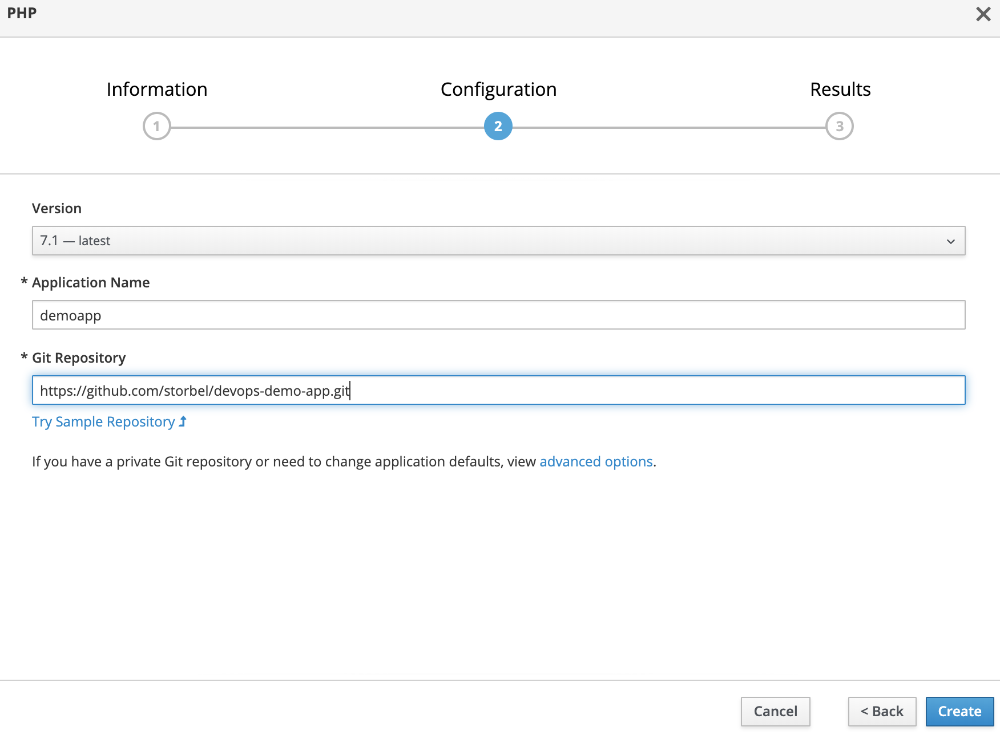

## Deploying Devops Demo PHP Application for GitHub Repo

In this section we are deploying sample devops demo PHP app from GitHub repo.
we use the same cluster earlier deployed simple application with **acs**  as  namespace/project.
This docs demonstrates how to get a simple project up and running on OpenShift. Application that will serve a welcome page Welcome to the DevOps Demo Application.

### Console
Make sure you have selected **acs**. If not  switch  to it from web console.

* click the Browse catalog you can see here multiple programming languages and databases.
* select the php you can see here php+mysql and only php choose *php*


* After selecting the language provide the information ,
configuration

   * In configuration you can provides version of the programming language and following GitHub repo.

```
https://github.com/devopsdemoapps/devops-demo-app.git
```


* click on the advance options

In this section you can provides following options.
* reference

* Tag

* Routing

* Deployment Configuration

* scaling

* Resource Limit

* Labels
### Cli
```
$ oc new-app https://github.com/storbel/devops-demo-app.git
--> Found image dc5aa55 (7 weeks old) in image stream "openshift/php" under tag "7.1" for "php"

    Apache 2.4 with PHP 7.1
    -----------------------
    PHP 7.1 available as container is a base platform for building and running various PHP 7.1 applications and frameworks. PHP is an HTML-embedded scripting language. PHP attempts to make it easy for developers to write dynamically generated web pages. PHP also offers built-in database integration for several commercial and non-commercial database management systems, so writing a database-enabled webpage with PHP is fairly simple. The most common use of PHP coding is probably as a replacement for CGI scripts.

    Tags: builder, php, php71, rh-php71

    * The source repository appears to match: php
    * A source build using source code from https://github.com/storbel/devops-demo-app.git will be created
      * The resulting image will be pushed to image stream tag "devops-demo-app:latest"
      * Use 'start-build' to trigger a new build
    * This image will be deployed in deployment config "devops-demo-app"
    * Ports 8080/tcp, 8443/tcp will be load balanced by service "devops-demo-app"
      * Other containers can access this service through the hostname "devops-demo-app"

--> Creating resources ...
    imagestream.image.openshift.io "devops-demo-app" created
    buildconfig.build.openshift.io "devops-demo-app" created
    deploymentconfig.apps.openshift.io "devops-demo-app" created
    service "devops-demo-app" created
--> Success
    Build scheduled, use 'oc logs -f bc/devops-demo-app' to track its progress.
    Application is not exposed. You can expose services to the outside world by executing one or more of the commands below:
     'oc expose svc/devops-demo-app'
    Run 'oc status' to view your app.
```


 Then click create project. After create project automated build build your project .
 In the web console, view the Overview page for your project to determine the web address for your application. Click the web address displayed right side web console open this link on new tab.

 


### Working with OpenShift CLI

```
 oc project acs
 oc get pods
```

 [output]
```
 NAME                READY     STATUS      RESTARTS   AGE
front-end-1-build   0/1       Completed   0          22m
front-end-1-x59fd   1/1       Running     0          21m
```

 getting all replicas
```
 oc get rc
```
 [output]
```
 NAME          DESIRED   CURRENT   READY     AGE
front-end-1   1         1         1         22m
```

getting all services
```
 oc get svc
```

 [output]
```
 NAME        TYPE        CLUSTER-IP     EXTERNAL-IP   PORT(S)             AGE
front-end   ClusterIP   172.30.25.85   <none>        8080/TCP,8443/TCP   24m
```
 describe front-end services

```
 oc describe svc front-end
Name:              front-end
Namespace:         devops-demo-app
Labels:            app=front-end
Annotations:       openshift.io/generated-by=OpenShiftWebConsole
Selector:          deploymentconfig=front-end
Type:              ClusterIP
IP:                172.30.25.85
Port:              8080-tcp  8080/TCP
TargetPort:        8080/TCP
Endpoints:         172.17.0.8:8080
Port:              8443-tcp  8443/TCP
TargetPort:        8443/TCP
Endpoints:         172.17.0.8:8443
Session Affinity:  None
Events:            <none>
```

 getting deploymentconfig
```
 oc get dc
```
[output]
```
NAME        REVISION   DESIRED   CURRENT   TRIGGERED BY
front-end   1          1         1         config,image(front-end:latest)\

```

getting build
```
oc get build
```
[output]
```
NAME          TYPE      FROM          STATUS     STARTED          DURATION
front-end-1   Source    Git@6ef2140   Complete   29 minutes ago   34s

```
getting route
```
oc get route
```
[output]
```
NAME        HOST/PORT                                          PATH      SERVICES    PORT       TERMINATION   WILDCARD
front-end   front-end-devops-demo-app.128.199.213.193.nip.io             front-end   8080-tcp                 None
```
describe route
```
oc describe route front-end
```
[ouutput]
```
Name:			front-end
Namespace:		devops-demo-app
Created:		32 minutes ago
Labels:			app=front-end
Annotations:		openshift.io/generated-by=OpenShiftWebConsole
			openshift.io/host.generated=true
Requested Host:		front-end-devops-demo-app.128.199.213.193.nip.io
			  exposed on router router 32 minutes ago
Path:			<none>
TLS Termination:	<none>
Insecure Policy:	<none>
Endpoint Port:		8080-tcp

Service:	front-end
Weight:		100 (100%)
Endpoints:	172.17.0.8:8443, 172.17.0.8:8080

```